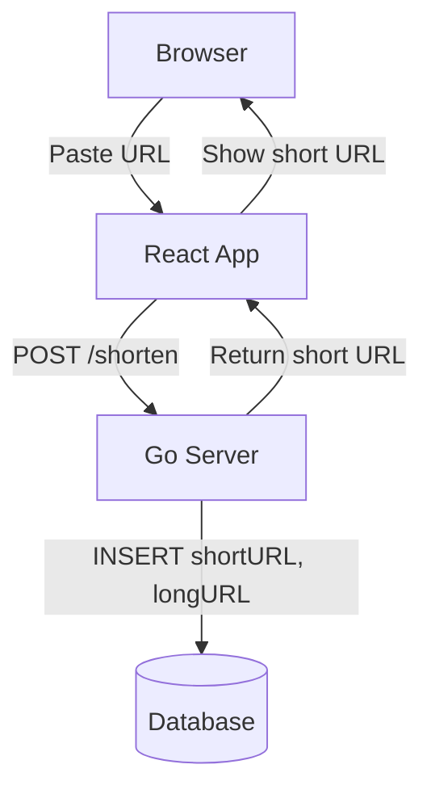
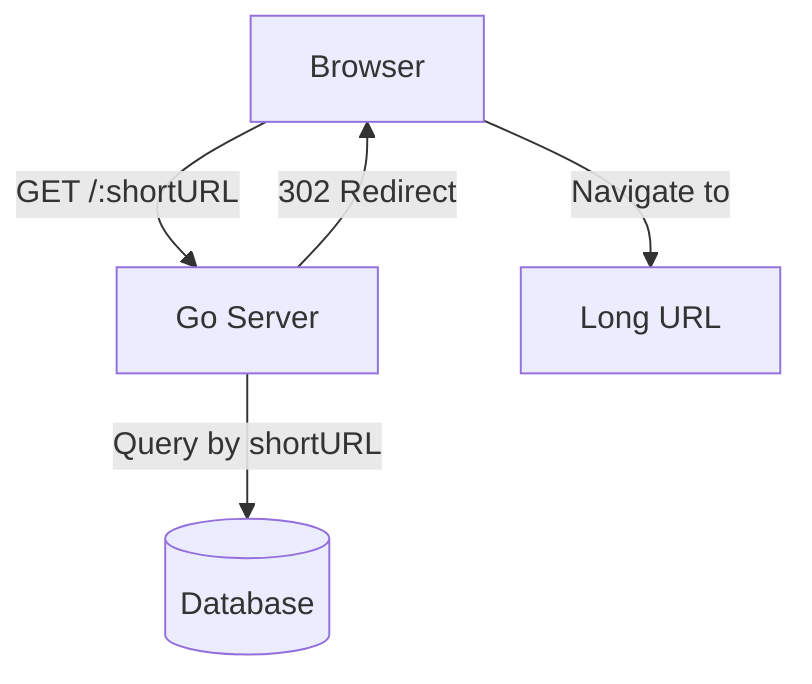

### Shorten Flow

```mermaid
graph TD;
    U1[Browser] --> |Paste URL| R[React App]
    R --> |POST /shorten| G[Go Server]
    G --> |INSERT shortURL, longURL| DB[(Database)]
    G --> |Return short URL| R
    R --> |Show short URL| U1  
```

### Redirect Flow

```mermaid
graph TD;
    U2[Browser] --> |GET /:shortURL| G[Go Server]
    G --> |Query by shortURL| DB[(Database)]
    G --> |302 Redirect| U2
    U2 --> |Navigate to| L[Long URL]
```   